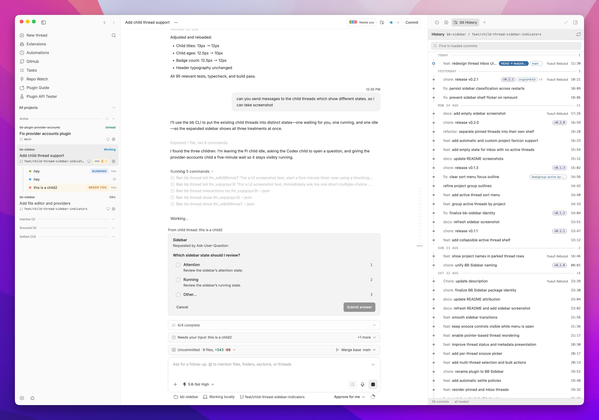
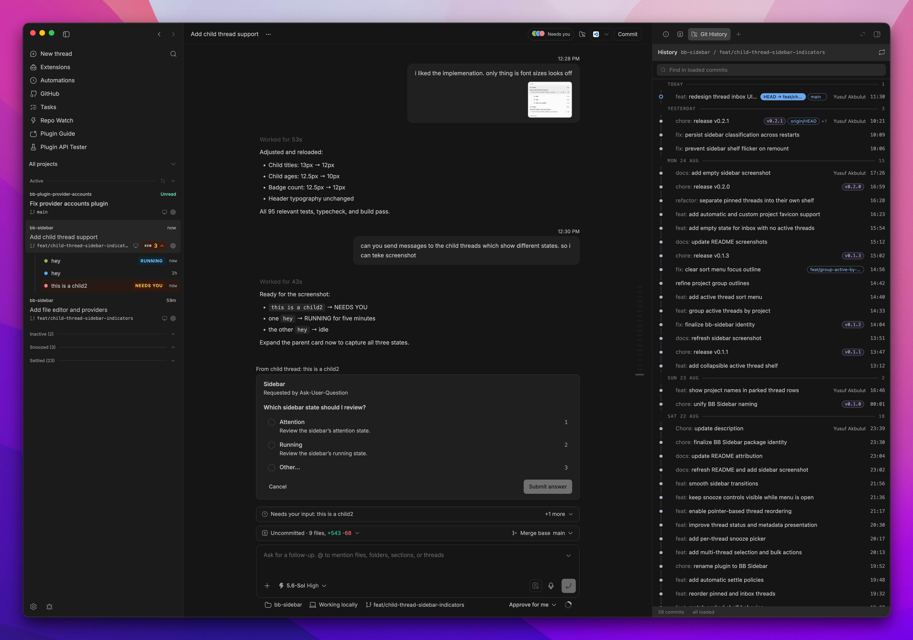
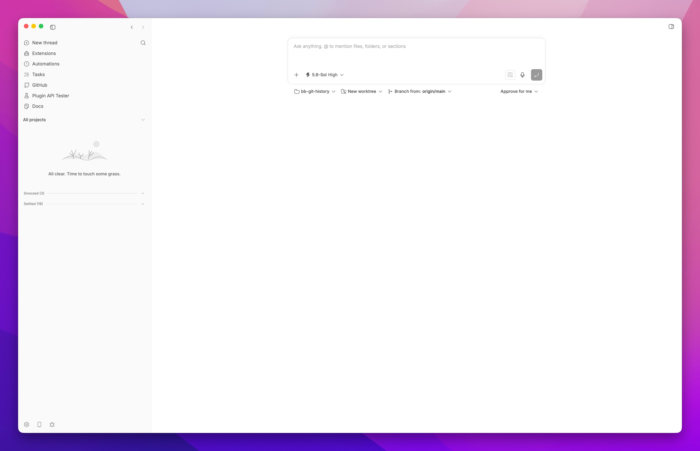

# BB Sidebar

A stable thread list for [bb](https://github.com/get-bb/bb). Threads stay where you put them while status, snooze, settle, and bulk actions remain close at hand.







## Features

- Manual ordering plus Recent activity, Date created, and Project sort modes
- Subtle project grouping for projects with multiple active threads
- Pinned, Active, Inactive, Snoozed, and Settled shelves
- Project filtering and multi-select bulk actions
- Automatic favicons, custom project icons, and two-step project removal
- Expandable child-thread indicators with running and attention states
- Live status, branch, pull request, and provider details
- Native bb navigation, split, rename, archive, and delete flows
- A **Bots** shelf when the [Bots Sidebar](https://github.com/tobi/bb-bots-sidebar) plugin is installed (this fork)

## This fork

This copy lives in [mikeastock/dotfiles](https://github.com/mikeastock/dotfiles)
under `bb-plugins/bb-plugin-bb-sidebar/`, vendored from
[yusuf8834/bb-sidebar](https://github.com/yusuf8834/bb-sidebar) at v0.2.4
(`77e3696`) so it can be modified in place. bb loads it from that path:

```sh
cd bb-plugins/bb-plugin-bb-sidebar
npm install
bb plugin install "$PWD" --yes
```

Then choose **BB Sidebar** under **Settings > Appearance > Sidebar**. The
plugin id stays `bb-sidebar`, so an install over the upstream release keeps
its database — lifecycle rows, manual order, project icons and settings.

## Bots, from the Bots Sidebar plugin

[tobi/bb-bots-sidebar](https://github.com/tobi/bb-bots-sidebar) gives bb named
bots — an identity, memory and avatar — and binds conversations to them. It is
also a sidebar replacement, and bb allows exactly one, so choosing this list
used to mean losing the bots view. This fork shows them too.

When that plugin is installed and enabled, a **Bots** shelf sits between
Pinned and Active. Each bot is one row: its avatar (a compact rendition of the
same colour, silhouette and expression), its name and role, and a status slot
that rolls up every conversation the bot owns in the list's own words —
"Needs you" (with a count past one), "Working", "Failed", "Unread", otherwise
how many conversations the row groups. The bot's Active conversations sit
under it as ordinary cards, in the Active shelf's own order, with their
children in the usual chip. Click the row to open the bot's main conversation
(its newest one if the main is gone); fold it shut with the chevron, and the
row keeps answering for the count. The shelf collapses like the others.
Custom sections from the bots plugin keep their headings; its unnamed main
section stays unnamed. A bot hidden "until activity" over there is hidden here
by the same rule, and its quiet conversations return to Active as plain cards
— a thread must always have a row somewhere.

Everything else is unchanged: pinned stays pinned wherever the work belongs,
Inactive, Snoozed and Settled stay flat, project scope applies to bots (a
scoped list shows the bots linked to or working in that project), and search
keeps its flat results.

Nothing here writes to the bots plugin. Creating, editing, assigning and
hiding bots stay in Bots Sidebar; switch to it under **Settings > Appearance
> Sidebar** for those, and back again.

How it reads them: a plugin frontend can only call its own backend, so this
plugin's server asks bb to call the bots plugin's `bots_list` RPC on its
behalf (`bb.sdk.plugins.callRpc`) and re-serves the answer as `listBots`,
narrowed on the way to what a row needs. A bot's private state — its
instructions, memory, settings — is dropped at the parse and never reaches
this plugin's frontend. The bots plugin publishes its changes on its own
realtime channel, which this plugin cannot hear, so freshness comes from this
plugin's own signal after a thread is created (delayed 1.5s, so the bots
plugin has bound the thread first), a change in the thread list, a reconnect,
and a slow tick once a minute. Without the bots plugin, `listBots` answers
"unavailable" and the shelf simply does not exist — no error, no toast.

The **Bots shelf** switch on the sidebar settings page turns it off; off, the
list never asks for bots.

## Install (upstream)

```sh
bb plugin install git:https://github.com/yusuf8834/bb-sidebar.git
```

Then choose **BB Sidebar** under **Settings > Appearance > Sidebar**.

Project icons use `t3.json`, common favicon and app icon paths, and local icon
metadata. To pick a different image, open BB Sidebar's plugin settings and use
the **Project icons** section. Projects without a matching image keep the
icon-free layout.

The Inactive shelf is enabled by default and moves unpinned threads after six
hours without activity. Both the switch and hour threshold are available in
BB Sidebar's plugin settings.

## Development

```sh
npm install
npm run build
bb plugin install path:. --yes
```

## Credits

This project includes code adapted from [bb-plugin-t3sidebar](https://github.com/SawyerHood/bb-plugin-t3sidebar). Its MIT copyright notice remains in [LICENSE](LICENSE).

The sidebar design and interactions are directly inspired by [T3 Code](https://github.com/pingdotgg/t3code), which is also released under the MIT License. See [THIRD_PARTY_NOTICES.md](THIRD_PARTY_NOTICES.md) for details.
