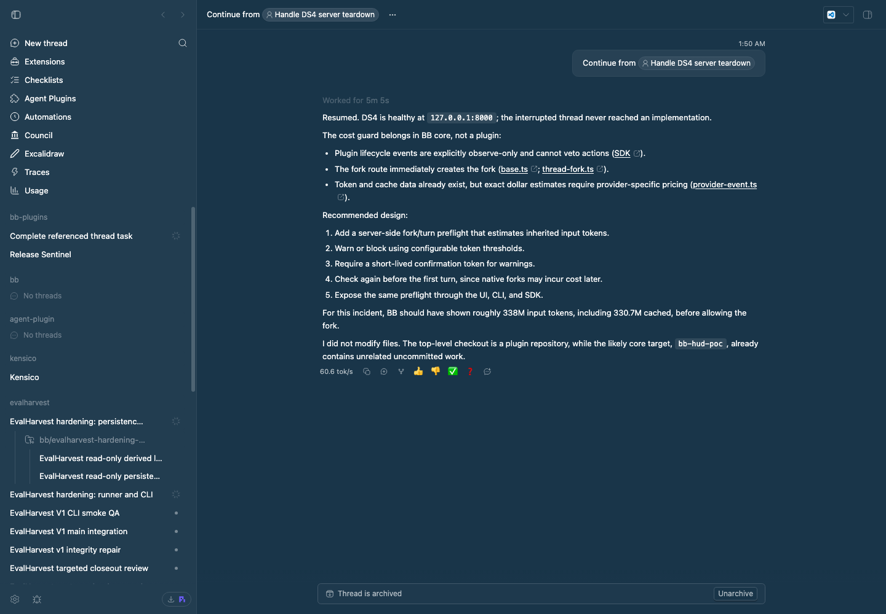

# Tok Speed

Tok Speed displays a small `tok/s` label in each assistant message's hover
action row. The number is visible provider-output speed for that turn: visible
output tokens divided by active assistant-message time. It deliberately
excludes hidden reasoning, commands, tool results, and other host work, so it
answers “how quickly did the provider stream the text I saw?”

The plugin reads BB's provider item lifecycle and visible-message delta events,
plus `thread/tokenUsage/updated`. It uses the running usage total when present,
which avoids double-counting repeated snapshots, and falls back to the latest
snapshot for older event rows. Providers that do not report usable
visible-output usage or completed assistant-message timings simply have no
label. The label's tooltip includes the visible output tokens and usage samples
included in the pooled rate.

BB stores events in batches, so a very short response can have no trustworthy
duration in the event log. Those samples are omitted instead of producing a
misleading rate.

## Pi threads

BB prunes its event log: it keeps only the newest `thread/tokenUsage/updated`
snapshot per thread and drops streaming deltas once an item resolves. For Pi
threads that leaves nothing to measure, so Tok Speed reads the Pi session file
BB's Pi bridge writes instead: `$BB_PI_BRIDGE_SESSION_DIR/<providerThreadId>.jsonl`,
defaulting to `~/.bb/pi-bridge-sessions/`. The `providerThreadId` comes from
each turn's `turn/started` event.

Each Pi assistant entry records when its request started, when it finished,
and its output tokens. A response belongs to the BB turn it started in,
bounded by `turn/started` (minus 1 s, because Pi's first response starts a few
milliseconds before BB records the turn) and `turn/completed`. The rate is
the turn's summed output tokens over summed response time. This differs from
the event-log rate: response time includes time to first token, and output
tokens include thinking. The tooltip says so.

The session file lives on the host where Pi runs, so this works when that host
is the BB server's machine. It depends on the Pi bridge's internal file layout
(`resolvePiSessionFilePath` in BB's Pi provider).

## Staged preview



This screenshot is captured from BB's rendered thread UI with seeded local
conversation data, a hovered assistant message, and a live `tok/s` decoration
in the bottom action row.

## Install

```sh
bb plugin install ./packages/bb-plugin-tok-speed --yes
```

## Development

```sh
pnpm --dir packages/bb-plugin-tok-speed test
pnpm --dir packages/bb-plugin-tok-speed typecheck
pnpm --dir packages/bb-plugin-tok-speed build
```
