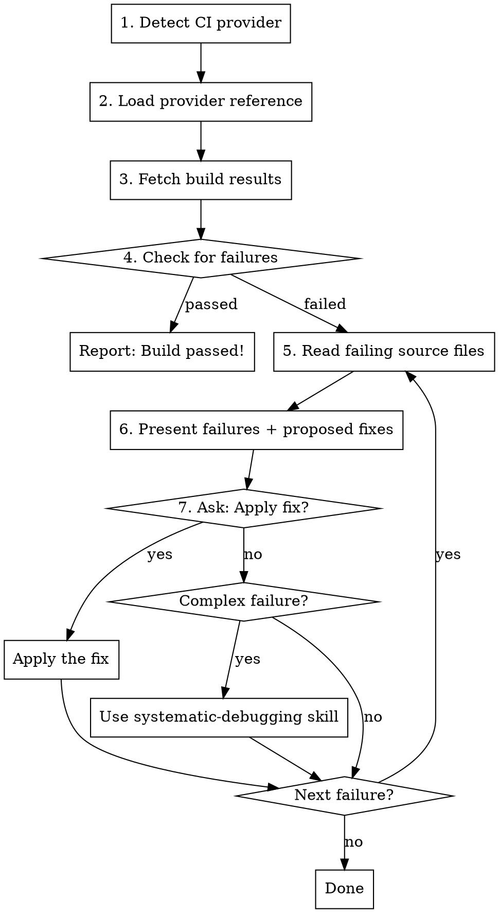

# Fetch CI Build

## Overview

Fetch CI build results, diagnose failures, extract actionable error information, and suggest fixes. Supports multiple CI providers with automatic detection.

## Supported Providers

| Provider | Detection | Tool |
|----------|-----------|------|
| GitHub Actions | `.github/workflows/` or `github.com` URL | `gh` CLI |
| Buildkite | `.buildkite/` or `buildkite.com` URL | Python script |
| CircleCI | `.circleci/` or `circleci.com` URL | Python script |

## Auto-Detection

### From URL

If the user provides a CI URL, detect provider:
- `github.com/.../actions/runs/...` → GitHub Actions
- `buildkite.com/...` → Buildkite
- `app.circleci.com/...` or `circleci.com/...` → CircleCI

### From Project Files

Check for CI configuration directories:
```bash
# GitHub Actions
test -d .github/workflows && echo "github"

# Buildkite
test -d .buildkite && echo "buildkite"

# CircleCI
test -d .circleci && echo "circleci"
```

## Workflow



## Step-by-Step Process

### 1. Detect CI Provider

First, check if the user provided a URL. If not, detect from project files.

### 2. Load Provider Reference

Read the appropriate reference file for provider-specific commands:
- GitHub: [references/github.md](references/github.md)
- Buildkite: [references/buildkite.md](references/buildkite.md)
- CircleCI: [references/circleci.md](references/circleci.md)

### 3. Fetch Build Results

Use the provider-specific commands to fetch build information and failures.

### 4. For Each Failure

Read the relevant source file to understand context:
- For test failures: read the test file at the indicated line
- For lint errors: read the source file at the indicated line
- For TypeScript errors: read the file and understand the type issue

### 5. Present Findings and Propose Fix

Show the user:
- What failed (test name, file, line)
- Error message
- Proposed fix based on the error

### 6. Ask User What To Do

Ask how to proceed:
- "Apply the suggested fix"
- "Investigate further before fixing"
- "Skip this failure"
- "Use systematic-debugging for deeper investigation"

### 7. Complex Failures

If the failure requires deeper investigation (e.g., unclear root cause, flaky test, environmental issue), recommend the `systematic-debugging` skill.

## Error Types Detected

| Type | Detection | Common Fixes |
|------|-----------|--------------|
| Test failure | Minitest/RSpec/Jest/pytest output | Fix assertion, update expected value, fix test setup |
| Lint error | Rubocop/ESLint/Biome violations | Auto-fix with linter's fix command |
| TypeScript | TSC compilation errors | Add types, fix type mismatches |
| Build error | Compilation failures | Fix syntax, missing dependencies |

## Common Mistakes

| Mistake | Solution |
|---------|----------|
| Can't detect provider | Specify provider explicitly or provide CI URL |
| Missing credentials | Check provider reference for required env vars/auth |
| Build still running | Wait for completion or check partial results |
| Rate limiting | Wait and retry |

## Integration with Other Skills

- **systematic-debugging**: Use for complex failures requiring root cause analysis
- **test-driven-development**: After fixing, ensure tests follow TDD principles
- **verification-before-completion**: Run tests locally before pushing fix
