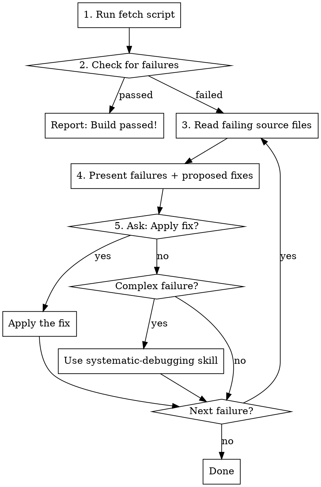

# Fetching Buildkite Failures

## Overview

Diagnose and fix CI failures by fetching build results from Buildkite, extracting actionable error information, and suggesting fixes.

## Prerequisites

Environment variables must be set:
- `BUILDKITE_API_TOKEN` - Buildkite API token with read access
- `BUILDKITE_ORGANIZATION_SLUG` - Organization slug (e.g., `buildr`)

## Workflow



## Quick Reference

**Fetch failures for current branch:**
```bash
python scripts/fetch_buildkite_failures.py
```

**Fetch specific build:**
```bash
python scripts/fetch_buildkite_failures.py --build 1723
```

**Fetch different branch:**
```bash
python scripts/fetch_buildkite_failures.py --branch main
```

## Step-by-Step Process

### 1. Fetch Build Failures

Run the script to get structured JSON output:

```bash
python scripts/fetch_buildkite_failures.py
```

The script outputs JSON with:
- Build info (number, branch, state, URL)
- Failed jobs with extracted errors
- Summary counts by error type

### 2. For Each Failure

Read the relevant source file to understand context:
- For test failures: read the test file at the indicated line
- For lint errors: read the source file at the indicated line
- For TypeScript errors: read the file and understand the type issue

### 3. Present Findings and Propose Fix

Show the user:
- What failed (test name, file, line)
- Error message
- Proposed fix based on the error

### 4. Ask User What To Do

Use the question tool to ask:
```
"How would you like to proceed with this failure?"
Options:
- "Apply the suggested fix"
- "Investigate further before fixing"
- "Skip this failure"
- "Use systematic-debugging for deeper investigation"
```

### 5. Complex Failures

If the failure requires deeper investigation (e.g., unclear root cause, flaky test, environmental issue), recommend the `systematic-debugging` skill.

## Error Types Detected

| Type | Detection | Common Fixes |
|------|-----------|--------------|
| Test failure | Minitest/RSpec failure output | Fix assertion, update expected value, fix test setup |
| Lint error | Rubocop/Biome violations | Auto-fix with `rubocop -a` or `pnpm biome:fix` |
| TypeScript | TSC compilation errors | Add types, fix type mismatches |
| Database | ActiveRecord errors | Run migrations, fix schema |

## Common Mistakes

| Mistake | Solution |
|---------|----------|
| Missing env vars | Set `BUILDKITE_API_TOKEN` and `BUILDKITE_ORGANIZATION_SLUG` |
| Wrong branch | Use `--branch` flag or check `git branch --show-current` |
| Build still running | Wait for completion or check partial results |
| Rate limiting | Wait and retry |

## Integration with Other Skills

- **systematic-debugging**: Use for complex failures requiring root cause analysis
- **test-driven-development**: After fixing, ensure tests follow TDD principles
- **verification-before-completion**: Run tests locally before pushing fix
