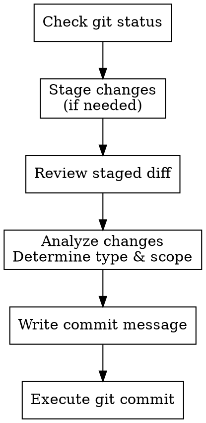

# Semantic Commit

Create git commits following the [Conventional Commits](https://www.conventionalcommits.org/) specification.

## Commit Format

```
<type>[optional scope][!]: <description>

[optional body]

[optional footer(s)]
```

- **Breaking changes**: Add `!` after the type/scope, or include `BREAKING CHANGE:` in the footer
- **Scope**: Optional, describes the section of the codebase (e.g., `feat(api):`, `fix(auth):`)

## Commit Types

| Type | Description |
|------|-------------|
| `feat` | A new feature |
| `fix` | A bug fix |
| `docs` | Documentation only changes |
| `style` | Changes that do not affect the meaning of the code (formatting, semicolons, etc.) |
| `refactor` | A code change that neither fixes a bug nor adds a feature |
| `perf` | A code change that improves performance |
| `test` | Adding missing tests or correcting existing tests |
| `build` | Changes that affect the build system or external dependencies |
| `ci` | Changes to CI configuration files and scripts |
| `chore` | Other changes that don't modify src or test files |
| `revert` | Reverts a previous commit |

## Workflow



### 1. Check Repository State

```bash
git status --short
git diff --cached --stat   # staged changes
git diff --stat            # unstaged changes
```

### 2. Stage Changes

If no changes are staged:
- Ask which files to stage, or
- Stage all with `git add -A`

### 3. Review Staged Changes

```bash
git diff --cached
```

Understand what was modified to write an accurate message.

### 4. Determine Type and Scope

Based on the changes:
- **Type**: What category of change? (feat, fix, refactor, etc.)
- **Scope**: What area of the codebase? (optional but helpful)
- **Breaking**: Does this break backward compatibility?

## Writing Good Commit Messages

### Subject Line

- Use imperative mood: "add feature" not "added feature"
- Keep under 50 characters
- Don't end with a period
- Be specific: "add user authentication" not "update code"

<Good>
```
feat(auth): add OAuth2 login support
fix: prevent crash on empty input
refactor(api): extract validation logic
```
</Good>

<Bad>
```
updated some stuff
fix bug
WIP
changes
```
</Bad>

### Body (Optional)

Use when the "why" isn't obvious from the subject:
- Explain motivation for the change
- Contrast with previous behavior
- Note any side effects

```
fix(parser): handle unicode characters in filenames

Previously, filenames with non-ASCII characters would cause
a decode error. Now using UTF-8 decoding with fallback to
latin-1 for legacy files.

Closes #123
```

### Footer (Optional)

- `BREAKING CHANGE: description` for breaking changes
- `Closes #123` or `Fixes #456` for issue references
- `Co-authored-by: Name <email>` for pair programming

## Examples

| Changes | Commit |
|---------|--------|
| New endpoint added | `feat(api): add user profile endpoint` |
| Bug causing crash | `fix: prevent null pointer on empty config` |
| Updated README | `docs: add installation instructions` |
| Reformatted code | `style: apply prettier formatting` |
| Renamed internal function | `refactor: rename processData to parseInput` |
| Optimized query | `perf(db): add index for user lookups` |
| Added unit tests | `test: add coverage for auth module` |
| Updated dependencies | `build: upgrade react to v18` |
| Changed CI config | `ci: add node 20 to test matrix` |
| Cleaned up files | `chore: remove unused imports` |
| Breaking API change | `feat(api)!: change response format` |

## Common Mistakes

| Mistake | Fix |
|---------|-----|
| Past tense ("added") | Use imperative ("add") |
| Too vague ("fix bug") | Be specific ("fix null check in parser") |
| Too long subject | Keep under 50 chars |
| Wrong type | `fix` = bug, `feat` = new capability, `refactor` = no behavior change |
| Combining unrelated changes | Split into multiple commits |

## Quick Reference

```
feat:     New feature for users
fix:      Bug fix for users  
docs:     Documentation only
style:    Formatting, no logic change
refactor: Code change, no behavior change
perf:     Performance improvement
test:     Adding/fixing tests
build:    Build system, dependencies
ci:       CI configuration
chore:    Maintenance, tooling
revert:   Reverting commits
```
