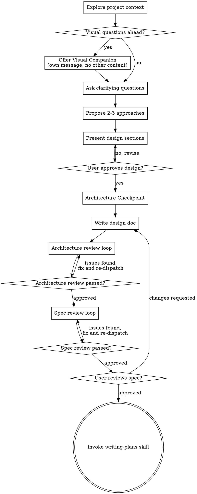

# Brainstorming Ideas Into Designs

Help turn ideas into fully formed designs and specs through natural collaborative dialogue.

Start by understanding the current project context, then ask questions one at a time to refine the idea. Once you understand what you're building, present the design in small sections, checking after each section whether it looks right before continuing.

<HARD-GATE>
Do NOT invoke any implementation skill, write any code, scaffold any project, or take any implementation action until you have presented a design and the user has approved it. This applies to EVERY project regardless of perceived simplicity.
</HARD-GATE>

## Anti-Pattern: "This Is Too Simple To Need A Design"

Every project goes through this process. A todo list, a single-function utility, a config change — all of them. "Simple" projects are where unexamined assumptions cause the most wasted work. The design can be short (a few sentences for truly simple projects), but you MUST present it and get approval.

## Checklist

You MUST complete these items in order:

1. **Explore project context** — check files, docs, recent commits
2. **Offer visual companion** (if topic will involve visual questions) — this is its own message, not combined with a clarifying question. See the Visual Companion section below.
3. **Ask clarifying questions** — one at a time, understand purpose/constraints/success criteria
4. **Propose 2-3 approaches** — with trade-offs and your recommendation
5. **Present design section by section** — scale sections to their complexity, get user approval after each section before continuing
6. **Architecture Checkpoint** — challenge ownership, boundaries, invariants, failure modes, compatibility paths, and tests before writing the design doc
7. **Write design doc** — save to `docs/design/YYYY-MM-DD-<topic>.md` and commit
8. **Architecture review loop** — dispatch architecture-reviewer subagent with the design path and relevant code/docs; fix blocking issues and re-dispatch until approved (max 3 iterations, then surface to human)
9. **Spec review loop** — dispatch spec-document-reviewer subagent with precisely crafted review context (never your session history); fix issues and re-dispatch until approved (max 3 iterations, then surface to human)
10. **User reviews written spec** — ask user to review the design file before proceeding
11. **Transition to implementation** — invoke writing-plans skill to create implementation plan

## Process Flow

**The terminal state is invoking writing-plans.** Do NOT invoke frontend-design, mcp-builder, or any other implementation skill. The ONLY skill you invoke after brainstorming is writing-plans.

## The Process

**Understanding the idea:**

- Check out the current project state first (files, docs, recent commits)
- Before asking detailed questions, assess scope: if the request describes multiple independent subsystems (e.g., "build a platform with chat, file storage, billing, and analytics"), flag this immediately. Don't spend questions refining details of a project that needs to be decomposed first.
- If the project is too large for a single spec, help the user decompose into sub-projects: what are the independent pieces, how do they relate, what order should they be built? Then brainstorm the first sub-project through the normal design flow. Each sub-project gets its own spec → plan → implementation cycle.
- For appropriately-scoped projects, ask questions one at a time to refine the idea
- Prefer multiple choice questions when possible, but open-ended is fine too
- Only one question per message - if a topic needs more exploration, break it into multiple questions
- Focus on understanding: purpose, constraints, success criteria

**Exploring approaches:**

- Propose 2-3 different approaches with trade-offs
- Present options conversationally with your recommendation and reasoning
- Lead with your recommended option and explain why

**Presenting the design:**

- Once you believe you understand what you're building, present the design
- Scale each section to its complexity: a few sentences if straightforward, up to 200-300 words if nuanced
- Present one section at a time, not the whole design in one message
- Ask after each section whether it looks right so far, and wait for the user's response before continuing
- Cover: architecture, components, data flow, error handling, testing
- Be ready to go back and clarify if something doesn't make sense

## Architecture Checkpoint

Before writing the design doc, explicitly challenge the proposed design:

- **Ownership:** Which module owns each domain object, operation, and side effect?
- **Boundaries:** What is the smallest interface each unit exposes, and what does it depend on?
- **Invariants:** What must always be true before and after each operation?
- **Failure modes:** Which errors fail fast, which are recoverable, and where are they translated for users?
- **Compatibility:** Does the design introduce fallback paths, adapters, dual writes, or historical-state bridges? If so, remove them unless the user explicitly asked for compatibility.
- **Existing patterns:** Which local abstractions should be reused, and which old code should be deleted instead of wrapped?
- **Architecture tests:** Which tests prove the boundary, invariant, or orchestration decision rather than only exercising happy-path behavior?

If this review changes the design materially, present the revised section and get approval again before writing the design doc.

**Design for isolation and clarity:**

- Break the system into smaller units that each have one clear purpose, communicate through well-defined interfaces, and can be understood and tested independently
- For each unit, you should be able to answer: what does it do, how do you use it, and what does it depend on?
- Can someone understand what a unit does without reading its internals? Can you change the internals without breaking consumers? If not, the boundaries need work.
- Smaller, well-bounded units are also easier for you to work with - you reason better about code you can hold in context at once, and your edits are more reliable when files are focused. When a file grows large, that's often a signal that it's doing too much.

**Working in existing codebases:**

- Explore the current structure before proposing changes. Follow existing patterns.
- Where existing code has problems that affect the work (e.g., a file that's grown too large, unclear boundaries, tangled responsibilities), include targeted improvements as part of the design - the way a good developer improves code they're working in.
- Don't propose unrelated refactoring. Stay focused on what serves the current goal.

## Visual Companion

For topics that involve visual questions (UI mockups, layouts, diagrams), offer the browser-based visual companion. See `visual-companion.md` for the full guide.

**Offer it as its own message** — not combined with a clarifying question. Only offer when the topic will genuinely benefit from visual presentation.

## After the Design

**Documentation:**

- Write the validated design to `docs/design/YYYY-MM-DD-<topic>.md`
- Use elements-of-style:writing-clearly-and-concisely skill if available
- Commit the design document to git

**Spec Review Loop:**

After writing the spec document, first run an architecture review loop:

1. Dispatch architecture-reviewer subagent with precisely crafted context — never your session history.
   - Provide: design path, relevant existing code/docs, core decision points, and known constraints.
   - Ask it to review ownership, boundaries, invariants, failure modes, compatibility paths, existing-pattern fit, and architecture-level tests.
2. If Issues Found: fix the design, re-dispatch reviewer for the whole design.
3. If Approved: continue to document review.
4. If loop exceeds 3 iterations, surface to human for guidance.

Then run the document review loop:

1. Dispatch spec-document-reviewer subagent (see spec-document-reviewer-prompt.md)
2. If Issues Found: fix, re-dispatch, repeat until Approved
3. If loop exceeds 3 iterations, surface to human for guidance

**User Review Gate:**

After the spec review loop passes, ask the user to review the written spec before proceeding:

> "Design written and committed to `<path>`. Please review it and let me know if you want to make any changes before we start writing out the implementation plan."

Wait for the user's response. If they request changes, make them and re-run the spec review loop. Only proceed once the user approves.

**Implementation:**

- Invoke the writing-plans skill to create a detailed implementation plan

## Key Principles

- **One question at a time** - Don't overwhelm with multiple questions
- **Multiple choice preferred** - Easier to answer than open-ended when possible
- **YAGNI ruthlessly** - Remove unnecessary features from all designs
- **Explore alternatives** - Always propose 2-3 approaches before settling
- **Incremental validation** - Present design in sections, validate each
- **Be flexible** - Go back and clarify when something doesn't make sense
