# Technical Explainer Comic

Build one layered document from a real implementation:

- **Scan:** a short visual story in which each panel advances the system by one causal step.
- **Inspect:** an expandable trace under every panel with the exact mechanics behind that step.
- **Cross-check:** an optional appendix for state families, alternate paths, and constraints
  that would clutter the main story.

The finished story should answer four questions in order:

1. Why does this component exist, and what sits outside its boundary?
2. How is the context for later work established?
3. What happens during one normal unit of work?
4. What changes during failure, recovery, or load?

Skip questions that do not apply, but keep establishment and normal operation distinct when
the implementation has both. Preserve source accuracy; the comic is a view of the system, not
a substitute for inspecting it.

## Required companion skills

- Load and follow `editorial-sketches` before planning or generating images. Its Xiaohei
  character and visual contract are the default; honor a user-supplied mascot or art direction.
- Use the available built-in raster image-generation skill or tool for every panel.
- When publication is requested, load and follow the available static-artifact publication
  skill (`buildr-artifacts` in this environment).

If a required capability is unavailable, complete the stages that remain possible and report
the missing capability. Never replace requested generated illustrations with placeholder
boxes or claim an artifact was published without a returned URL.

## Read before working

- Read `references/trace-contract.md` before source investigation.
- Read `references/manifest-schema.md` before writing the artifact manifest.
- Read `references/evaluation.md` only when testing or changing this skill.

## Workflow

```dot
digraph explainer {
  rankdir=LR;
  evidence -> "story spine";
  "story spine" -> "separate panel images";
  "separate panel images" -> manifest;
  manifest -> "HTML render";
  "HTML render" -> "deterministic validation";
  "deterministic validation" -> "desktop/mobile QA";
  "desktop/mobile QA" -> publication;
}
```



### 1. Build the evidence packet

Inspect the current implementation and its installed dependency code when dependency behavior
is part of the explanation. Follow repository guidance and prefer current code over memory or
old documentation.

Capture these facts in a scratch `evidence.md`:

- the reader's main question and the component's purpose
- actors and ownership boundaries
- the establishment path, such as setup, authorization, enqueue, connection, or scheduling
- one normal unit of work, such as a request, job, event, command, or batch
- persistent and in-memory state, including keys and lifetimes
- inputs, outputs, side effects, credential locations, and trust boundaries
- renewal, retry, cancellation, expiry, cleanup, and failure behavior
- scaling shape, bottlenecks, limits, and unproven assumptions
- source paths for every material claim

Label inference as inference. Do not turn a configured TTL, platform limit, or architectural
shape into a throughput guarantee.

Completion criterion: every fact in `evidence.md` names its source, every inference is labeled,
and the packet answers each applicable section of `references/trace-contract.md`.

### 2. Design the story spine

Create a short shot list before generating. Use three to nine panels, the range supported by
the renderer. Build the spine from this arc, keeping only beats supported by evidence:

1. boundary — what the component owns, what it delegates, and why it exists
2. establishment — how a caller, job, or session first becomes known
3. durable context or handoff — what must survive one process, when applicable
4. one normal operation from entry to result
5. the strictest trust, execution, or side-effect boundary crossed by that operation
6. lifecycle — renewal, retry, expiry, cancellation, cleanup, and failure
7. scaling shape and honest uncertainty

Expand a beat only when it helps the reader follow the actual system. An authorization service
might split establishment into registration, authorization, callback, and credential issuance.
A queue worker might split normal operation into claim, process, and acknowledge. One panel
explains one cognitive turn; never pad toward nine.

For each panel record:

- theme
- one core technical idea
- the causal transition from the previous panel
- structure type
- the recurring character's necessary action
- one original physical metaphor
- exact short labels
- the technical facts that will appear beneath it

Completion criterion: reading only the panel titles and callouts answers the four questions
above, establishment and normal operation are not conflated, and every panel has one central
idea backed by the evidence packet.

### 3. Generate and inspect every panel

Generate each illustration separately; never ask the image model to compose the whole comic.
Follow the `editorial-sketches` visual contract and prompt template instead of restating it.
Keep color meaning consistent across the strip and with the manifest legend. The defaults are:

- orange — input or work movement
- blue — state or trusted processing
- red — constraint or failure

Save originals. Copy accepted panels to:

```text
<artifact-dir>/assets/<slug>-illustrations/01-topic.png
```

Open every generated file at readable size. Regenerate or edit misspelled labels, a decorative
recurring character, crowded layouts, inconsistent color meaning, repeated metaphors,
non-white backgrounds, or slide-like diagrams.

Completion criterion: every final image passes the `editorial-sketches` QA checklist, has the
intended labels and legend semantics, and is a real 16:9 image in the artifact directory.

### 4. Write the two reading layers

The visible layer must stay plain and concise:

- a title that makes one causal claim rather than naming a topic
- one short explanation paragraph
- one key-point callout
- the illustration and a short caption

The expandable technical trace must carry the precision:

- numbered causal steps, or bullets when the panel is an inventory
- exact entry points: endpoints, functions, events, queues, commands, or schedules
- identities, inputs, routing keys, and important identifiers
- validation and trust-boundary checks
- state reads and writes with lifetimes
- downstream side effects, outputs, cleanup, retry, and failure behavior

Keep the trace in the same causal order as the visible panel. When the system persists multiple
state families, add an appendix record table. Add a compact appendix card for alternate paths
or constraints that would otherwise confuse the main story.

Write `manifest.json` using `references/manifest-schema.md`, then render:

```bash
python3 <skill-dir>/scripts/render_explainer.py \
  --manifest <work-dir>/manifest.json \
  --output <artifact-dir>
```

Use `--force` only when intentionally replacing the generated `index.html`.

Completion criterion: the visible layer is understandable without opening details, while the
expanded traces reproduce the supported establishment and normal-operation paths without
skipping material state transitions, side effects, or failure behavior.

### 5. Validate the artifact

Run the deterministic validator:

```bash
python3 <skill-dir>/scripts/validate_explainer.py \
  --manifest <work-dir>/manifest.json \
  --artifact <artifact-dir>
```

Serve the directory over HTTP and use the product-native browser automation first. Validate:

- desktop and mobile viewport
- correct page title and meaningful first screen
- every image loaded
- no framework overlay or console error
- no horizontal overflow
- sticky panel navigation works
- at least one technical trace opens and exposes the expected exact detail

Fix the artifact and repeat the same checks.

Completion criterion: deterministic validation passes and rendered desktop/mobile evidence
shows a readable artifact with one successfully exercised trace interaction.

### 6. Publish and verify

Publish the static directory with the selected static-artifact publication skill. It must
contain `index.html` at its root. After upload, request the hosted index and every panel asset.
Report the returned URL only after those checks pass.

If publication credentials or permissions are unavailable, preserve the complete local
artifact and report the exact blocker. This is a static artifact; do not publish it through a
host that requires a running server.

## Output layout

```text
<work-dir>/
├── evidence.md
├── shot-list.md
└── manifest.json

<artifact-dir>/
├── index.html
└── assets/
    └── <slug>-illustrations/
        ├── 01-topic.png
        └── ...
```

Keep the evidence packet out of the published directory unless the user explicitly requests it.
Do not publish secrets, raw credentials, customer data, or unredacted production logs.

## Handoff

Report:

- the published URL or local artifact path
- panel count and what each panel explains
- which panels are strongest and which are optional
- deterministic and browser validation performed
- any unverified runtime, deployment, or capacity claim
- the saved image and manifest paths
