# Technical Explainer Comic

Turn a real implementation into a visual story that reads simply first and reveals exact
technical detail on demand. Preserve source accuracy; the comic is a view of the system, not
a substitute for inspecting it.

## Required companion skills

- Load and follow `editorial-sketches` before planning or generating images.
- Use the available built-in raster image-generation skill or tool for every panel.
- Load and follow `buildr-artifacts` before publishing the finished static directory.

If a required capability is unavailable, complete the stages that remain possible and report
the missing capability. Never replace requested generated illustrations with placeholder
boxes or claim an artifact was published without a returned URL.

## Read before working

- Read `references/trace-contract.md` before source investigation.
- Read `references/manifest-schema.md` before writing the artifact manifest.
- Read `references/evaluation.md` only when testing or changing this skill.

## Workflow

```dot
digraph explainer {
  rankdir=LR;
  evidence -> "story spine";
  "story spine" -> "separate panel images";
  "separate panel images" -> manifest;
  manifest -> "HTML render";
  "HTML render" -> "deterministic validation";
  "deterministic validation" -> "desktop/mobile QA";
  "desktop/mobile QA" -> publication;
}
```



### 1. Build the evidence packet

Inspect the current implementation and its installed dependency code when dependency behavior
is part of the explanation. Follow repository guidance and prefer current code over memory or
old documentation.

Capture these facts in a scratch `evidence.md`:

- actors and ownership boundaries
- entry endpoints and discovery
- the ordered authorization or setup flow
- the ordered normal request flow
- persistent and in-memory state, including keys and lifetimes
- credential locations and trust boundaries
- refresh, retry, revocation, expiry, and failure behavior
- scaling shape, bottlenecks, limits, and unproven assumptions
- source paths for every material claim

Label inference as inference. Do not turn a configured TTL, platform limit, or architectural
shape into a throughput guarantee.

Completion criterion: every sentence planned for the artifact is supported by inspected code,
installed dependency code, current configuration, or an explicitly named authoritative source.

### 2. Design the story spine

Create a short shot list before generating. Use three to nine panels unless the user asks for a
different length. Prefer this narrative order when it applies:

1. system boundary and why the component exists
2. registration, setup, or discovery
3. authorization or initial handoff
4. callback and durable state creation
5. token or credential issuance
6. one normal authenticated request
7. the protected execution boundary
8. refresh, revocation, and failure
9. scaling shape and honest uncertainty

For each panel record:

- theme
- one core technical idea
- structure type
- Xiaohei's necessary action
- one original physical metaphor
- exact short labels
- the technical facts that will appear beneath it

Merge or omit beats that do not exist in the implementation. One panel explains one cognitive
turn; do not force the nine-panel example onto a smaller system.

Completion criterion: the shot list can be read as a complete end-to-end trace and no material
fact appears in more than one panel without a clear reason.

### 3. Generate and inspect every panel

Generate each illustration separately. Never ask the image model to compose the whole comic.
Use the `editorial-sketches` visual contract and its prompt template:

- 16:9 horizontal
- pure white background
- black hand-drawn line art
- restrained orange, blue, and red annotations
- at least 35% empty space
- Xiaohei performing the explanatory action
- exact short English labels unless the source language differs

Save originals. Copy accepted panels to:

```text
<artifact-dir>/assets/<slug>-illustrations/01-topic.png
```

Open every generated file at readable size. Regenerate or edit misspelled labels, decorative
Xiaohei, crowded layouts, non-white backgrounds, repeated metaphors, or slide-like diagrams.

Completion criterion: every final image passes the `editorial-sketches` QA checklist, has the
intended labels, and is a real 16:9 image in the artifact directory.

### 4. Write the two reading layers

The visible layer must stay plain and concise:

- panel title
- one short explanation paragraph
- one blue callout containing the key idea

The expandable technical trace must carry the precision:

- ordered HTTP, RPC, queue, or function steps
- exact endpoints, methods, key families, and important identifiers
- validation and trust-boundary checks
- state reads and writes with lifetimes
- retry, refresh, and failure behavior

Add a record map when the system persists multiple state families. Add a compact exception card
for alternate paths that would otherwise confuse the main story.

Write `manifest.json` using `references/manifest-schema.md`, then render:

```bash
python3 <skill-dir>/scripts/render_explainer.py \
  --manifest <work-dir>/manifest.json \
  --output <artifact-dir>
```

Use `--force` only when intentionally replacing the generated `index.html`.

Completion criterion: the visible layer is understandable without opening details, while the
expanded traces reproduce the end-to-end behavior without skipping material state transitions.

### 5. Validate the artifact

Run the deterministic validator:

```bash
python3 <skill-dir>/scripts/validate_explainer.py \
  --manifest <work-dir>/manifest.json \
  --artifact <artifact-dir>
```

Serve the directory over HTTP and use the product-native browser automation first. Validate:

- desktop and mobile viewport
- correct page title and meaningful first screen
- every image loaded
- no framework overlay or console error
- no horizontal overflow
- sticky panel navigation works
- at least one technical trace opens and exposes the expected exact detail

Fix the artifact and repeat the same checks.

Completion criterion: deterministic validation passes and rendered desktop/mobile evidence
shows a readable artifact with one successfully exercised trace interaction.

### 6. Publish and verify

Publish the static directory with `buildr-artifacts`. It must contain `index.html` at its root.
After upload, request the hosted index and every panel asset. Report the returned URL only after
those checks pass.

If upload credentials or permissions are unavailable, preserve the complete local artifact and
report the exact blocker. Do not switch to a stateful app host for a static explainer.

## Output layout

```text
<work-dir>/
├── evidence.md
├── shot-list.md
└── manifest.json

<artifact-dir>/
├── index.html
└── assets/
    └── <slug>-illustrations/
        ├── 01-topic.png
        └── ...
```

Keep the evidence packet out of the published directory unless the user explicitly requests it.
Do not publish secrets, raw credentials, customer data, or unredacted production logs.

## Handoff

Report:

- the published URL or local artifact path
- panel count and what each panel explains
- which panels are strongest and which are optional
- deterministic and browser validation performed
- any unverified runtime, deployment, or capacity claim
- the saved image and manifest paths
